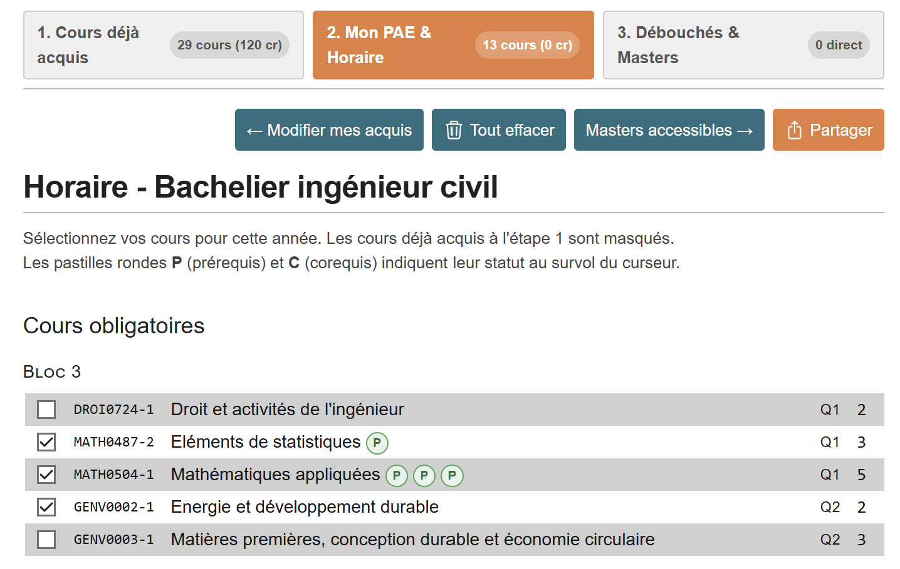

# FACSA PAE Planner

<p align="left">
  <a href="https://facsa-pae-planner.vercel.app/"></a>
  <a href="https://www.facsa.uliege.be/"></a>
  <a href="https://www.programmes.uliege.be/cocoon/20242025/programmes/ABICIV0099_C.html"></a>
  <a href="https://www.mmm.uliege.be/facsa/horaires/ABICIV0099"></a>
  <a href="LICENSE"></a>
</p>

> [!NOTE]
> **Accès direct à l'application** : [facsa-pae-planner.vercel.app](https://facsa-pae-planner.vercel.app/)

Outil interactif d'aide à la décision conçu pour les étudiants et l'équipe pédagogique de la **Faculté des Sciences Appliquées (FACSA)** de l'**Université de Liège (ULiège)**.

Le système permet de composer son **Programme Annuel de l'Étudiant (PAE)**, de simuler son **horaire hebdomadaire sans conflit**, de vérifier le respect des **règles académiques officielles (prérequis et corequis)**, et d'analyser son éligibilité vers les **12 Masters d'ingénieur civil**.

<p align="center">
  <a href="https://facsa-pae-planner.vercel.app/">
    
  </a>
</p>
<p align="center">
  <em>Composition interactive du PAE : calcul dynamique des crédits Q1/Q2, validation visuelle des prérequis (P) et corequis (C), et barre d'état permanente.</em>
</p>

---

## Compatibilité avec l'outil officiel ULiège

L'application s'appuie sur le moteur et l'ergonomie de l'outil horaire officiel développé pour la faculté :
* **Outil officiel ULiège** : [https://www.mmm.uliege.be/facsa/horaires/ABICIV0099](https://www.mmm.uliege.be/facsa/horaires/ABICIV0099)

> [!TIP]
> **Rétrocompatibilité totale à 100%**
> * **Algorithme bitpack identique** : L'outil utilise exactement le même encodage de compression d'état dans le hash d'URL (`#b=...`).
> * **Interopérabilité bidirectionnelle** : N'importe quel lien généré sur le site de l'université s'ouvre fidèlement dans cette application. Inversement, toute sélection réalisée ici peut être ouverte directement sur le site officiel en un clic via le bouton de partage.

---

## Comparatif des fonctionnalités

| Fonctionnalité | Outil officiel ULiège | FACSA PAE Planner |
| :--- | :---: | :---: |
| **Grille horaire hebdomadaire interactive (Q1 / Q2)** | ✓ | ✓ *(Identique)* |
| **Détection dynamique des conflits d'horaires** | ✓ | ✓ *(Identique)* |
| **Partage d'horaire par URL (`#b=...`)** | ✓ | ✓ *(100% rétrocompatible)* |
| **Export de l'agenda au format `.ics`** | — | ✓ *(Google Calendar, Apple, Outlook)* |
| **Déclaration des cours déjà validés (Étape 1)** | — | ✓ *(Raccourcis Bloc 1, Blocs 1 & 2)* |
| **Filtrage automatique des cours validés du PAE** | — | ✓ |
| **Contrôle d'antériorité des prérequis bloquants** | — | ✓ *(Pastilles P et alertes jury)* |
| **Détection des dérogations de corequis à déclarer** | — | ✓ *(Pastilles C et tableau récapitulatif)* |
| **Comptabilisation précise des crédits ECTS** | Sommaire | ✓ *(Total, Q1, Q2 et équilibre)* |
| **Simulateur d'orientation vers les 12 Masters (Étape 3)** | — | ✓ *(Accès direct, mineure, standard)* |
| **Détail des cours de domaine requis par Master** | — | ✓ *(Regroupés par Bloc 2 et Bloc 3)* |
| **Persistance locale de la session (`localStorage`)** | — | ✓ *(Aucune perte au rechargement)* |

---

## Organisation du flux de travail

L'interface guide l'étudiant à travers **3 étapes progressives** :

### 1. Cours déjà acquis
* Déclaration rapide des crédits déjà obtenus les années précédentes.
* Préréglages immédiats : **« Bloc 1 réussi »** (60 ECTS obligatoires) et **« Blocs 1 & 2 réussis »** (106 ECTS obligatoires).
* Les crédits acquis sont comptabilisés et automatiquement conservés dans le stockage local du navigateur.

### 2. Mon PAE & Horaire
* Affichage du catalogue des cours de la faculté **débarrassé des cours déjà réussis**.
* **Indicateurs visuels des exigences académiques** :
  * Pastille `P` verte : prérequis validé.
  * Pastille `P` rouge : prérequis manquant (inscription réglementairement impossible sans dérogation).
  * Pastille `C` verte : corequis acquis ou déjà sélectionné au PAE.
  * Pastille `C` orange : corequis manquant (dérogation officielle requise lors de l'inscription).
* **Panneaux d'analyse officielle sous le tableau** : synthétisent les dérogations à introduire auprès du jury et confirment la validité du programme annuel.
* **Bascule horaire** : consultation de l'emploi du temps hebdomadaire avec identification en temps réel des chevauchements d'horaires.

### 3. Débouchés & Simulateur des 12 Masters
* Analyse en continu de l'accès aux **12 filières de Master d'ingénieur civil** de l'ULiège :
  * *Informatique*
  * *Science des Données*
  * *Mécanique*
  * *Aérospatiale*
  * *Électricien*
  * *Énergie*
  * *Constructions (Génie Civil)*
  * *Chimie et Science des Matériaux*
  * *Biomédical*
  * *Mines et Géologue*
  * *Physicien*
  * *Architecte*
* **Niveaux d'accès calculés selon les règles facultaires** :
  * **Accès direct de plein droit garanti** : $\ge$ 30 ECTS dans les cours de l'option principale.
  * **Accès avec mineure (passerelle allégée)** : 10 à 25 ECTS dans le domaine.
  * **Programme standard** : moins de 10 ECTS.
* **Tableaux détaillés par Bloc (Bloc 2 / Bloc 3)** : consultation des cours du domaine avec pastilles d'état (`Acquis`, `Au PAE`, `Non suivi`) et possibilité d'inscrire directement un cours manquant au PAE.

---

## Architecture technique

L'application a été conçue selon une approche d'empreinte minimale, assurant performance et pérennité :

* **Fichier unique autonome** : [index.html](index.html) embarque l'ensemble du balisage, des styles CSS, de la logique réactive Alpine.js, du sprite SVG et des dictionnaires de cours.
* **Aucun backend requis** : fonctionnement purement côté client, sans base de données, sans dépendance externe au runtime et sans collecte de données personnelles.
* **Générateur reproductible** : [build_clean_official.py](build_clean_official.py) est un script Python pur (standard library uniquement) qui assemble les données institutionnelles et compile la version autonome.

---

## Démarrage local

Pour exécuter le projet localement :

```bash
# Cloner le dépôt
git clone https://github.com/nathannremacle/facsa-pae-planner.git
cd facsa-pae-planner

# Démarrer un serveur HTTP statique
python -m http.server 8080
```

L'application est ensuite accessible sur `http://localhost:8080/`.

Pour recompiler le fichier autonome après mise à jour des données :
```bash
python build_clean_official.py
```

---

## Licence & Mentions

* Structure d'horaire et styles d'origine © Université de Liège (ULiège) — Faculté des Sciences Appliquées.
* Extension PAE, vérification des prérequis/corequis, moteur d'analyse des Masters © Nathan Remacle — Distribué sous licence MIT.
